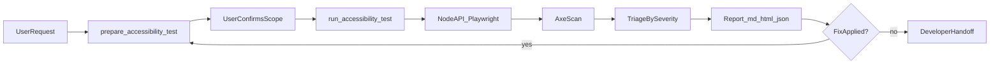
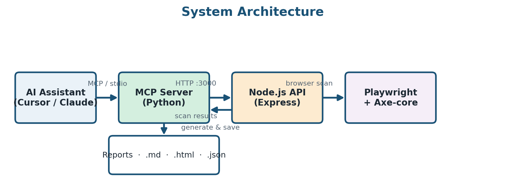
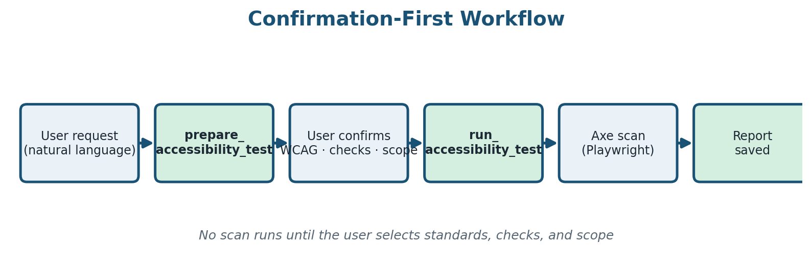

# Accessibility Compliance Automation — Case Study

> Professional engagement with **Datacom**. The implementation is private because of client confidentiality. This case study covers the problem, my role, workflow, decisions, and outcomes — I can walk through architecture and redacted examples in an interview

---

## TL;DR

- **Problem:** Enterprise QA teams need WCAG compliance checks, but manual audits require specialist expertise and existing tools dump raw violations without actionable guidance or AI workflow integration. It cost time, and resouces.
- **What I did:** Led a 4-person team to build an MCP-powered audit pipeline (Playwright + Axe-core) that runs ~30-second scans from natural-language commands in Cursor or Claude Desktop (any MCP client).
- **Outcome:** Zero-config developer adoption, three report formats (Markdown / HTML / JSON), WCAG 2.0–2.2 support — enabling Datacom QA to integrate accessibility into sprint workflows without deep a11y expertise.
- **Level-up:** Moved from building features to stakeholder liaison, JS/TS code review, confirmation-first test design, and sprint-integrated quality delivery.

---

## Client context (abstract)

**Client:** Datacom— NZ enterprise IT services and digital delivery.

**Problem:** Manual accessibility audits require specialist knowledge most developers do not have. Existing tooling surfaces raw Axe violation data without clear fix guidance and does not integrate with the AI assistant workflows teams already use daily. Datacom needed a way to run WCAG checks earlier in the release cycle, at lower cost, without waiting on external specialists.

**My role:** Team lead, client liaison, and engineer on a 4-person squad. I owned MCP server configuration and contributed across unit/integration testing and troubleshooting.

**Scope (abstract):** Multi-page WCAG 2.x compliance auditing via natural-language AI commands; auth-gated and dynamic UI flows via browser automation; crawl → select pages → scan → triage → retest → report pipeline; sprint-integrable QA for Datacom teams.

---

## The challenge

### Technical

- **Unfamiliar stack:** My background is not web development. To review and contribute to the Node.js / TypeScript API layer, I spent a full day on fundamentals tutorials, then read the codebase line-by-line to link theory to the project. For abstract sections, I used AI-assisted explanations, rewrote them in my own words to verify understanding, and mapped each concept back to our implementation.
- **Real-world UI complexity:** Auth-gated pages, dynamic components, and false-positive noise from cookie banners and ads required scoped scanning, exclude presets, and manual triage — automation alone was not enough.

### People and process

- **Iterative delivery caused scope drift:** Frequent client feedback and plan changes early on pushed us toward features outside agreed scope.
- **Fix:** Adopted **Jira** (track in-progress / done / next; high-level end-to-end estimates plus short-term feature detail) and **Git** (contribution tracking, change attribution, recovery from bad merges). This disciplined how we collaborated under incremental delivery.
- **Stakeholder communication:** Explaining severity, prioritizing fixes, and handing actionable reports to developers — not just QA jargon — required ongoing client liaison work.

---

## What we built

End-to-end WCAG audit workflow:

1. **Scope** — Confirm test type (single page, multi-page, crawl, or retest), WCAG level, and target checks with the user before any scan runs.
2. **Crawl / enumerate** — Discover site pages; tester selects which URLs to include.
3. **Automated scan** — Playwright loads pages; Axe-core runs against confirmed parameters.
4. **Triage** — Classify violations by criticality; filter noise via exclude presets (ads, cookie banners, footers).
5. **Retest** — Compare results against a previous scan; verify specific violation IDs after fixes.
6. **Report** — Deliver Markdown (developers), HTML (stakeholders), or JSON (CI/CD).



**Confirmation-first gate:** No Axe scan runs until the user explicitly selects standards, checks, criticality, and scope.





### Sanitized workflow pattern

Two-step MCP gate — generic example, no client URLs:

```json
// Step 1: prepare (no scan yet)
{ "test_type": "single_page", "url": "https://example.com" }

// Step 2: run after user confirms parameters
{
  "request_id": "<from prepare>",
  "standards": ["wcag21aa"],
  "accessibility_checks": ["color-contrast", "image-alt"],
  "criticalities": ["critical", "serious"],
  "exclude_presets": ["ads", "cookie_banner"]
}
```

Exclude presets map to common selectors (e.g. `.cookie-banner`, `.ad`) so scans focus on meaningful content rather than chrome.

---

## Key decisions and trade-offs

| Decision | Why |
|----------|-----|
| **Confirmation-first MCP gate** | Prevents AI assistants from silently expanding scope (crawl vs single-page) or choosing WCAG parameters without user consent. |
| **Modular architecture** (Python MCP → Node API → Playwright/Axe) | Separates orchestration from browser execution; enables future Azure DevOps ticket creation and CI/CD triggers. |
| **Exclude presets and focus areas** | Reduces false positives from ads, popups, footers, and cookie banners; scopes scans to navigation, forms, or main content. |
| **Retest with delta comparison** | Developers verify fixes by violation ID without re-running full manual audits. |
| **Three report formats** | Markdown for devs, HTML for stakeholders, JSON for pipeline integration — same scan, different audiences. |
| **Jira + Git under iterative delivery** | Scope control when client feedback arrives every sprint; recover quickly from merge conflicts or broken builds. |
| **Incremental delivery** | Ship working slices, gather feedback, adjust — but only with tracking tools to avoid building beyond agreed scope. |

---

## Results (sanitized)

| Metric | Value |
|--------|-------|
| Audit time | ~30 s from natural-language command vs hours manually |
| Developer setup | Zero-config once MCP is connected to the IDE |
| Report formats | 3 — Markdown, HTML, JSON (CI/CD ready) |
| WCAG coverage | 2.0, 2.1, and 2.2 across all conformance levels (A / AA / AAA) |
| Automated tests | ~280+ across component, edge-case, and integration suites |
| CI matrix | Ubuntu + Windows; Python 3.10–3.11; Node 18–20 |

**Short-term impact:** Datacom QA teams can integrate WCAG compliance scanning into sprint workflows without specialist knowledge — reducing audit cost and enabling earlier defect detection.

**Long-term positioning:** Modular MCP architecture supports extension to Azure DevOps automated bug tickets, CI/CD pipeline triggers, and multi-user enterprise deployment — relevant as the EU Accessibility Act (2025) increases compliance demand across Datacom's client base.

---

## What I learned

- **Leading is not commanding** — it is making sure tasks happen, deadlines are met, and quieter teammates are encouraged to speak up.
- **Client liaison prevents wasted work** — understanding what the client wants early is cheaper than rework late.
- **You can ramp on an unfamiliar stack** by linking tutorials directly to line-by-line code reading in the actual project.
- **Iterative delivery without tracking tools causes scope drift** — Jira and Git are force multipliers for team projects.
- **Accessibility tooling must be actionable** — violation dumps alone do not get adopted; reports need severity, DOM location, and fix guidance.
- **Meet developers where they work** — integrating via AI assistants (MCP) beats standalone tools nobody opens.

---

## How this leveled me up

**Before:** I built features and demos. I did not systematically think about inclusive UX, stakeholder-driven delivery, web stack code review, or release quality gates.

**After:** I can lead a small team through iterative client work, liaise with enterprise stakeholders, configure and extend MCP-based QA tooling, read and review JavaScript/TypeScript, design confirmation-first test workflows, and communicate findings to mixed technical and non-technical audiences.

**Unlocked next:** CI/CD-integrated accessibility gates, Azure DevOps automation, enterprise multi-user deployment, and applied AI-assisted QA in graduate or intern roles.

---

## What I'd do differently

- Start pair/group programming earlier in the project.
- Set up Jira and professional project management from day one.
- Write simpler code with clear comments on every decision — not just every function.

---

## Tech stack

| Tool | Purpose |
|------|---------|
| MCP (Model Context Protocol) | AI assistant integration (Cursor, Claude Desktop) |
| Python 3 | MCP server orchestration, report generation |
| Node.js / TypeScript / Express | REST API for browser sessions and Axe configuration |
| Playwright | Browser automation, auth-gated page loading |
| Axe-core 4 | WCAG rule engine |
| Jira | Sprint tracking, scope control, client feedback |
| Git / GitHub | Version control, team contribution, CI |
| GitHub Actions | Automated test matrix (Ubuntu + Windows) |

---

## Repository contents

This repo contains the **public implementation** of the audit tooling described above.

| Path | Contents |
|------|----------|
| `MCP Server/` | Python MCP server — tool handlers, analyzers, report generators |
| `Accessibility_Endpoint/`| Node.js/TypeScript Express API — Playwright + Axe execution |
| `poster-assets/`| Architecture, workflow, and metrics diagrams |
| `.github/workflows/`| CI pipelines for automated testing |

No client URLs, credentials, session tokens, or unredacted audit reports are included in this repository.

---

## Limitations and ethics

- **Automated scanning is not full WCAG compliance.** Axe covers a subset of success criteria; manual review (keyboard navigation, screen reader testing, cognitive accessibility) remains essential.
- **Severity classification requires human judgment.** Automation finds issues; prioritization depends on user impact and release context.
- **Client confidentiality.** This case study describes process and capabilities. Proprietary client configurations, crawl targets, and production audit data are excluded.

---

## About the author

Final-year AUT student (Data Science + Cyber Security), Auckland, NZ — targeting graduate and intern roles in applied AI, QA automation, and data-adjacent engineering.

GitHub: [github.com/NguyenThuan-data](https://github.com/NguyenThuan-data)

Questions welcome — NguyenThuandata@gmail.com

---

